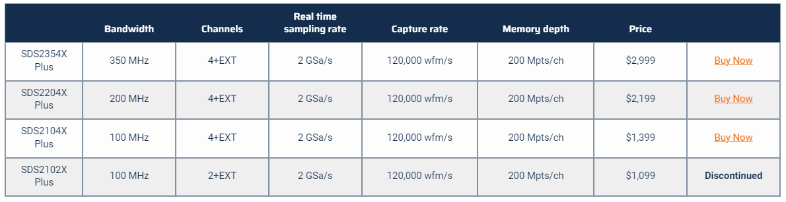

# Overview

One of the most common questions that I get during a [training](https://voidstarsec.com/training) is - "What do we need to build up an initial hardware hacking lab." Of course, the answer to this question can be heavily tailored based on the goals of the team and their targets, but I wanted to attempt documenting what would make for a good starter lab. 

The following document aims to outline the minimum requirements for an embedded systems laboratory; as a bare minimum, one should have the following in their lab:

1. Multimeter
2. Soldering Equipment
3. Breadboard/Jumper Wires
4. Logic Analyzer
5. Oscilloscope
6. Magnifying glass

In this list, I will focus on devices that I and a few others regularly use for hardware pen testing and research. I will list a range of devices covering various budgets. 

It should be noted that the following recommendations are my opinion, and **none** of the links below are affiliate links or anything of the sort. This guide is to help people build out their first lab, not make money. This guide will also be maintained at the GitHub repository located [here](https://github.com/voidstarsec/hw-hacking-lab) - please submit your pull requests with your suggestions and favorite tools!

## Contributors

Before we get to the fun stuff, I wanted to give credit to some folks that helped develop this article. Throughout the development of this guide, I was lucky enough to have some really sharp people offer to help me proofread and provide recommendations for some of the gear listed in this write up, I've included their names/handles below:

- [Jeremy Hong](https://twitter.com/ElectronicsbyJH)
- [Arsenio Menendez](https://twitter.com/Ascii211)
- [Stu Kennedy](https://twitter.com/NoobieDog)
- [Ian Hanschen](https://twitter.com/furan)
- [Dreg](https://twitter.com/therealdreg)
# Workbench

First and foremost, you need a place to perform your work. Depending on your needs this might be a small section on your desk, or you may need an entirely seperate workbench. When it comes to choosing a workbench, you'll quickly find that you can spend a _lot_ of money on a high end standing desk, especially if you're looking for a larger one. One place you might consider looking is Home Depot / Lowes, I am a big fan of their Husky standing workbench and am currently using two of them in my office. 

If you're looking for something more traditional, I also have built a handful of workbench setups using IKEA tabletops and legs, this is a very popular option for workstations.

| Item | Price | Link | 
| ---- | ---- | ---- | 
| Husky Adjustable Height 46in-72in Workbench | $268.00-$398.00 | [Link](https://www.homedepot.com/p/Husky-46-in-Adjustable-Height-Work-Table-with-2-Drawers-in-White-HOLT4602BJ2/312063246) | 
| Ikea LAGKAPTEN Tabletop | $49.99 | [Link](https://www.ikea.com/us/en/p/lagkapten-tabletop-black-brown-00487015) | 
| Ikea ADILS Leg | $7.50 | [Link](https://www.ikea.com/us/en/p/adils-leg-black-70217973/) | 
| Ikea Drawer Unit (ALEX) | $109.99 | [Link](https://www.ikea.com/us/en/p/alex-drawer-unit-black-brown-60473548/) | 

**Note:** The IKEA drawer units have mounting holes on top of them for attaching to IKEA tabletops which makes assembly extremely simple, and you get the added benefit of extra storage. 

## ESD Protections

The last thing that you want to happen is for you to accidentally destroy a device with static electricity, In order to avoid this, it is always a good idea to get an ESD wrist strap or an ESD protective mat. 

**Note:** Not all silicone mats that you will find on Amazon are actually anti-static, please make sure that you read the description of the mat that you are going to purchase if ESD protection is a high priority for your workspace (which it should be!)

| Item | Price | Link | 
| ---- | ---- | ---- | 
| ESD Wrist Strap | $9.99 | [Link](https://www.amazon.com/Wristband-Bracelet-Grounding-Alligator-Extendable/dp/B08CXQN86W) | 
| ULine ESD Wrist Strap | $18 | [Link](https://www.uline.com/BL_7401/Personal-Grounder-Wrist-Straps?pricode=WF412&AdKeyword=esd%20wrist%20strap&AdMatchtype=e&gclid=Cj0KCQjwsp6pBhCfARIsAD3GZuZYNL2sz4obdahz6QwO6rgeXwXduiviKJO3NHRiewp1jTRAPFhqCKQaAklfEALw_wcB) |
| Bertech ESD High Temp Mat | $44.30 | [Link](https://www.amazon.com/Bertech-Temperature-Rubber-Wrist-Grounding/dp/B01MDO2BGP) | 
| STATFREE UC2 Anti-Static Mat | $138.53 | [Link](https://www.digikey.com/en/products/detail/desco/66322/5822302)
| ULine Assorted Mats | $80-$1000 | [Link](https://www.uline.com/BL_7403/Anti-Static-Table-Mats) | 

DigiKey has a number of high quality ESD mats that you can find [here](https://www.digikey.com/en/products/filter/static-control-esd-clean-room-products/606?utm_adgroup=Static%20Control%20Mats).
# Soldering 

Whether you are tearing down a new router or looking for a new target to perform fault injection, you will need to solder at some point during your hardware hacking journey. Soldering is the process of joining metal surfaces with "solder"; this creates a conductive connection between the two soldered points. Soldering is useful when populating unused debug pin headers or connecting wires to points on your target circuit board that you wish to interact with. 

## Soldering Irons

When looking for a new iron, it is essential to keep your goals in mind:

- Are you mainly focusing on smaller surface mount device (SMD) rework projects?
- Will you be working with larger/older components that may need a lot of heat to remove?

Ideally, you want an iron with adjustable temperature and removable tips. These can be purchased relatively cheaply from Amazon and other online vendors. I recommend one with an emergency timeout in case you forget to turn off your iron after some late-night soldering. 

### Low Cost

Ideally, you want something with adjustable temperature and removable tips; below is a very solid starter kit from Amazon, which makes for a good beginner iron. Before buying a more expensive iron, use this iron to learn proper [care and maintenance](https://forum.digikey.com/t/how-to-clean-tin-and-maintain-soldering-iron-tip).

- [KSGER T12 Soldering Station](https://www.amazon.com/KSGER-Soldering-Electronic-Controller-Equipments/dp/B0974F1VQ5)

### High Cost

For high-end soldering or jobs that require you to solder to smaller components, such as 0402 components, a  JBC CDS station with intelligent heat management and sleep/hibernation modes can't be beaten. This is the station that I have used for quite a while now, and it has been highly reliable and easy to maintain. With this station, you can also get tweezer tips for SMD components, making these jobs much more manageable. It also can be connected to other JBC accessories, such as a fume extractor and other JBC handles. 

- [JBC CDS Soldering Station](https://www.jbctools.com/cds-precision-soldering-station-product-1580.html)
- [Additional Tips / Cartridges](https://www.jbctools.com/c210-cartridge-range-product-18.html)

If you have the funds to spare, the JBC DDPE 2-Tool station is great because it lets you have multiple tools active simultaneously. This station comes with micro tweezers and a T210 precision handle, which is compatible with a wide variety of cartridges. 

- [JBC DDPE 2-Tool Station](https://www.jbctools.com/ddpe-2-tool-precision-rework-station-product-1630.html)

## Hot Air Stations / Hot Plates

Hot air stations and hot plates can both be used when doing SMD rework. Hot plates work as you might expect, they require surface to surface contact in order to heat the target device, allowing for either solder paste or a traditional iron to be used to bond the solder to the contact pads. These of course have some disadvantages, if you are working with a system that has plastic connectors, housings or is a two sided PCB with components on each side you will not be able to effectively use a hotplate without risking damaging the target. Hot plates can be used in conjunction with a hot air gun in order to "preheat" your target, making component removal easier. 

### Low Cost

Introductory hot plates are releatively low cost, the [Soiiw Microcomputer Soldering Preheating station](https://www.amazon.com/Soiiw-Microcomputer-Soldering-Preheating-200X200mm/dp/B082H12PPT) is a great place to start as it has built in temperature control and display (helpful for letting others in the lab know that the plate is on!). 

If you are going for a lower-cost hot air rework station, there are plenty on Amazon. I have used the YIHUA 959D and have had no issues with it. Others have recommended the [QUICK 957D Rework Station](https://www.amazon.com/Quick-957DW-Hot-Station-Watt/dp/B074SBH4G5), which also has excellent reviews!

### High Cost

You will need a hot air station for BGA rework or other package removal. Like a standard soldering station, these can vary in price/quality. A higher-end hot air rework station will allow for precise temperature and airflow control; they will also have a wider variety of hose attachments, allowing for the removal/replacement of smaller components. When working with standard embedded systems, the JBC TESE is an excellent rework station that has multiple suction tips and hose sizes included:

- [JBC TESE](https://www.jbctools.com/tese-precision-hot-air-station-product-1255.html)

Of course, if you are looking to do a _lot_ of SMD rework and reflow on PCBs, you may want to consider the [SRS System SMD Rework](https://www.jbctools.com/srs-smd-rework-system-product-1454.html) station. 

This kit includes an arm, allowing for hands-free operation, as well as a preheater. A preheater is a device used to (as you might have guessed) pre-heat the PCB from below, allowing things to be soldered more easily. 

The full table of all of the recommended kits can be seen below:

| Item | Price | Link | 
| ---- | ---- | ---- | 
| Soiiw Microcomputer Soldering Preheating station | $67.99 | [Link](https://www.amazon.com/Soiiw-Microcomputer-Soldering-Preheating-200X200mm/dp/B082H12PPT) | 
| KSGER T12 Soldering Station | $69.99 | [Link](https://www.amazon.com/KSGER-Soldering-Electronic-Controller-Equipments/dp/B0974F1VQ5) | 
| JBC CDS Soldering Station | $595 | [Link](https://www.jbctools.com/catalegfitxa.php?idpro=1580#CDS) | 
| JBC DDPE 2-Tool Station | $1700 | [Link](https://www.jbctools.com/catalegfitxa.php?idpro=1630#DDPE) | 
| QUICK 957D Rework Station | $125.00 | [Link](https://www.amazon.com/Quick-957DW-Hot-Station-Watt/dp/B074SBH4G5) | 
| JBC TESE | $2,690 | [Link](https://www.jbctools.com/tese-b-precision-hot-air-station-product-1750.html) | 
| SRS System SMD Rework Station | $5,750 | [Link](https://www.jbctools.com/catalegfitxa.php?idpro=1454#SRS)  | 

## Soldering: Practice Kits

These kits are a great way to get comfortable soldering smaller devices and components. One thing I like to recommend is to solder it, desolder it, and then solder it again, this will give you practice with removing parts and adding them!

| Item | Price | Link | 
| ---- | ---- | ---- | 
| Soldering Practice Kit | $9 | [Link](https://www.amazon.com/Gikfun-Welding-Practice-Soldering-Training/dp/B00Y20JYTM) | 
| Soldering Practice Kit 2 | $9 | [Link](https://www.amazon.com/dp/B077QCJ2Z8/) | 

## Soldering Accessories

| Item | Price | Link | Description | 
| ---- |  ---- | ---- | ---- | 
| KOTTO Fume Extractor | $39.99 | [Link](https://www.amazon.com/Absorber-Remover-Extractor-Prevention-Soldering/dp/B07VWDN29F/ref=sr_1_1_sspa?keywords=fume%2Bextractor&qid=1696509608&sr=8-1-spons&sp_csd=d2lkZ2V0TmFtZT1zcF9hdGY&th=1) | Used to extract solder fumes, relatively portable for travel soldering | 
| Desoldering Braid | $9.99 | [Link](https://www.amazon.com/Lesnow-No-Clean-Desoldering-Removal-Dispenser/dp/B094GZ6CPZ) | Used to remove solder from a target, helpful when cleaning up QFP packages | 
| Tip Tinner | $8.00 | [Link](https://www.amazon.com/Thermaltronics-FBA_TMT-TC-2-Lead-Tinner-Container/dp/B00NS4J6BY) | Used to re-tin oxidized soldering iron tips, crucial for maintaining a working tip | 
| Magnet Wire | $7.99 | [Link](https://www.amazon.com/LUORNG-Soldering-Maintenance-Electromagnet-Technology/dp/B0B3J88T85) | Tiny wire, used for connecting to cut traces or small vias on PCBs| 
| 30 AWG Wire Wrap Wire | $11.99 | [Link](https://www.amazon.com/dp/B083352WFF) | Small AWG wires, convenient for soldering to small pads, etc. | 
| Kapton Tape | $11.98 | [Link](https://www.amazon.com/Temperature-Kapton-Professional-Protecting-Circuit/dp/B07RZYY2T1) | Heat resistant tape, helpful for protecting other components when doing hot air rework | 
| ChipQuik SMD 291 Flux | $15.95 | [Link](https://www.digikey.com/en/products/detail/chip-quik-inc./SMD291/355201) | Flux removes oxides and enhances solder flow, increasing the reliability of solder joints |  
| Engineer Solder Suction Device | $18.97 | [Link](https://www.amazon.com/Engineer-SS-02-Solder-Sucker/dp/B002MJMXD4?th=1) | Used to remove solder |

## Bonus: Learning to Solder

Below are some YouTube videos to help you learn how to solder if you've never attempted it. 

- [Soldering Crash Course: Basic Techniques](https://www.youtube.com/watch?v=6rmErwU5E-k)
- [SMD Soldering Tutorial](https://www.youtube.com/watch?v=fYInlAmPnGo)
- [BGA Reflowing for Absolute Beginners](https://www.youtube.com/watch?v=0zq98wqEZlo)

Hackaday has a great article [here](https://hackaday.com/2023/03/23/working-with-bgas-soldering-reballing-and-rework/) about SMD rework and reballing. 

# Multimeters

Regardless of the types of components and targets that you're working on, you will need a multimeter. This is what you will use for your initial survey of your device for things such as measuring voltage, resistance, and current and checking for continuity. When choosing a multimeter, make sure that you review the available voltage and current ranges and that they match the ranges of your expected targets. Some multimeters will also have an "auto-range" feature, which will attempt to automatically select the appropriate range for measuring voltage/current/resistance, etc. This feature can be helpful when measuring unknown voltages; it will save you a few button presses when measuring points on a target. The two multimeters listed below are the ones that I keep in my toolbox. I have also included different probes sets, allowing smaller pads/pins to be measured. 

| Item | Price | Link | 
| ---- | ---- | ---- | 
| Micsoa Multimeter Test Leads Kit | $20.99 | [Link](https://www.amazon.com/Micsoa-Electronic-Multimeter-Alligator-Replaceable/dp/B075DWKSFB) | 
| Crenova MS8233D | $29.99 | [Link](https://www.amazon.com/Crenova-Auto-Ranging-Multimeter-Measuring-Backlight/dp/B00KXX2OYY) | 
| Fluke High Precision Probes | $94.99 | [Link](https://www.digikey.com/en/products/detail/fluke-electronics/TL910/1801791)
| Fluke 115 | $220 | [Link](https://www.amazon.com/dp/B000OCFFMW/) | 

If you've never used a multimeter before, Sparkfun has a great tutorial [here](https://learn.sparkfun.com/tutorials/how-to-use-a-multimeter/introduction) that can help get you up to speed and measuring in no time!

# Microscopes/Magnification

When tearing down a target for the first time, you first want to locate and document all of the part numbers. Part numbers and PCB markings can sometimes be challenging to see with the naked eye, so having a cheap benchtop microscope or hand held loupe is never a bad idea. These will also come in handy when removing or modifying small components. Hand held loupes are great for quick identification of components. 

| Item | Price | Link | Description | 
| ---- | ---- | ---- | ---- | 
| Handheld Jewellers Loupes | $15.00 | [Link](https://www.amazon.com/Jewelers-Portable-Monocular-Magnifier-Magnifying/dp/B0B11NMDHL/ref=sr_1_35?keywords=jewellers+loupe&qid=1696879890&sr=8-35) | Small handheld jewellers loupes, various magnification, useful for part identification | 
| Plugable USB Microscope | $37.74 | [Link](https://www.amazon.com/Plugable-Microscope-Flexible-Observation-Magnification/dp/B00XNYXQHE) | Small USB compatible microscope, useful for some soldering and part identification, compatible with most desktop operating systems (in my experience) | 
| AMScope USB Microscope |  $78.99 | [Link](https://amscope.com/products/utp200x020mp?gclid=CjwKCAjwvfmoBhAwEiwAG2tqzD8VGm0ImwB4j8wP7EQEbC8_3Nvp6V2BFZ8PWMiX0qc3qU7_7MoCnBoCvAMQAvD_BwE) | Small USB compatible microscope, useful for some soldering and part identification | 
| MisVision Trinocular Microscope |  $78.99 | [Link](https://www.aliexpress.us/item/2251832694057535.html?gatewayAdapt=glo2usa4itemAdapt) | Benchtop microscope 7-45x zoom, check out the review [here](https://www.strangeparts.com/a-boy-and-his-microscope-a-love-story/) | 
| Aven Desktop Microscope | $697.91 | [Link](https://www.digikey.com/en/products/detail/aven-tools/26700-220-MNT/14310948) | 8-25x microscope with a built-in screen, helpful for soldering to small packages and doing bga rework | 
| MANTIS Serices MCH-001 Microscope | $1,310.00 | [Link](https://www.testequity.com/product/848IN4000-MCH-001) | High-powered microscope with interchangeable lenses, mounting arm, and lenses are sold separately | 

# Oscilloscopes

While multimeters help us measure various signals on our target device, an Oscilloscope can help us capture and visualize these measurements. When selecting a scope, you need to consider what the use case will be. Will you be doing differential power analysis or power trace captures? Or are you more interested in capturing other types of analog waveforms over a longer period? The main variables to look at when selecting an oscilloscope are:

- **Channel Count** - How many channels can you capture on
- **Memory Depth** - This is how long_ you can capture for
- **Sample Rate** - How fast the analog signal is sampled 
- **Bandwidth** -Maximum frequency of an input signal that can be passed through the analog front end (probe)

With enough bandwidth, you avoid capturing what appears to be a distorted signal, and with too slow of a sample rate, you risk data loss. 

**Remember**: According to the [Nyquist sampling theorem](https://www.sciencedirect.com/topics/engineering/nyquist-theorem#:~:text=Nyquist's%20theorem%20states%20that%20a,oscilloscope%20bandwidth%20would%20be%20typical.) sampling rate should be at least 2x the frequency of your target signal **at a minimum**!

An excellent introductory scope can be purchased for ~$500; all big manufacturers offer something in this range. For example, the SIGLENT SDS1104 is an excellent starting scope with a bandwidth of 100MHz and a sample rate of 1GSa/s. I've listed a few options below, ranging in price from lowest to highest, and included a few tables from some of the manufacturer's websites as well:

| Item | Price | Link | Description | 
| ---- | ---- | ---- | ---- | 
| Signlent SDS1104X | $399.00 | [Link](https://www.tequipment.net/Siglent/SDS1104X-U/Digital-Oscilloscopes) | Great starter scope, easy to use, SCPI compatible | 
| Rigol MSO5354 | $1,999 | [Link](https://www.rigolna.com/products/digital-oscilloscopes/mso5000/) | High-bandwidth and sample rate, less memory than the SDS2000X series, 16 digital channels for internal logic analyzer|
| SDS2000X | $2,999 | [Link](https://siglentna.com/product/sds2354x-plus/) | High bandwidth, 2GSa/s sampling rate, large memory depth, HDMI out, SCPI compatible |
| SDS6204A | $60,000 + | [Link](https://siglentna.com/digital-oscilloscopes/sds6000a-digital-storage-oscilloscope/) | Extremely high capture rate and bandwidth, decoders and other features can bring the price to $100k easily |

**Note:** Many modern oscilloscopes can be upgraded via software. For example, many will have built-in logic analyzers and signal decoders. These will come at an extra cost; decoders are typically $100-$400, depending on the protocol, and other software upgrades can be purchased to unlock things like faster sample rates and increased bandwidth, etc. It's easy for a 2-4 thousand dollar oscilloscope purchase to turn into a ten thousand dollar purchase once all the upgrades and add-ons have been included. 

### Example Specifications: Rigol

Below are some specifications from the RIGOL MSO5000 line:

The MSO5354 is an excellent deal for this line, especially considering the 350MHz bandwidth and the 8GSa/s sampling rate. I have this in my lab and use it regularly. 

### Example Specifications: Siglent

Here is a similar specification table from the SIGLENT SDS2000 line:

The Siglent and the Rigol have great options for the prices listed above. Make sure that you pick an appropriate scope per the types of targets you anticipate analyzing. 

# Logic Analyzers

Let's say you identified a fluctuating voltage sequence with your multimeter and decided to look at the signal with your oscilloscope. After viewing the signal with the oscilloscope, you saw sequences of high and low pulses that look something like this:

We will need a Logic Analyzer to make more sense of this signal capture. Logic analyzers are used when analyzing digital signals; they can take sequences of high and low voltages and translate them into a stream of logical 1s and 0s. This stream of 1s and 0s can then be analyzed and decoded via software to display packet structures and more user-friendly data to the user. When choosing a logic analyzer, we need to consider the following:

- Channel Count - How many channels can be analyzed at once?
- Sampling Rate - How quickly can we sample data
- Hardware Sampling Depth / Memory Depth - How long can we sample?
- Threshold Voltages - What voltage ranges are compatible with this device?

When analyzing standard COTS devices that utilize SPI, eMMC, etc., the Kingst and DSLogic series logic analyzers will work 90% of the time. The Saleae has a well-polished software interface, including APIs for writing decoders _and_ instrumenting captures. The analog capture features of the Saleae are also beneficial when debugging lower-level issues. Despite being the most expensive analyzers listed here, they are worth purchasing if your budget allows it. 

| Item | Price | Link | Description |
| ---- | ---- | ---- | ---- | 
| LA 1010 | $69.99 | [Link](https://www.amazon.com/LA1010-Analyzer-channels-software-instrument/dp/B07D21GG6J) | The [Kingst](http://www.qdkingst.com/en) LA series are suitable introductory logic analyzers, they are pulseview compatible and can also use the Kingst proprietary software |
| DSLogic | $149.00 | [Link](https://www.amazon.com/DreamSourceLab-USB-Based-Analyzer-Sampling-Interface/dp/B08C2QN9GQ) | DSLogic is a series of USB-based logic analyzer, with max sample rate up to 1GHz, and max sample depth up to 16G. It uses an open-source fork of Pulseview |
|  Analog Discovery 2 | $229.00 | [Link](https://digilent.com/shop/digital-discovery-portable-usb-logic-analyzer-and-digital-pattern-generator) | Multi-function USB Oscilloscope, Logic analyzer, signal generator and power supply |
| Saleae Logic 16 | $1500 | [Link](https://usd.saleae.com/products/saleae-logic-pro-16) | Logic analyzer with variable logic levels, analog capture capability, and highly user-friendly software |

# Clips / Jumpers / Probes

Sometimes, we have to connect to specific pads or pins to analyze the signal on our target device; but that does not always require soldering and removing components. Probing test pads and reading flash chips in-circuit can significantly reduce the debugging/analysis time when performing firmware patches or testing PoCs. Below are some helpful items that I use when soldering/connecting to new targets. The PCBite kit is handy as the fine-tip probes will often save you from needing to solder to test pads when performing initial analysis. 

| Item | Price | Link | Description | 
| ---- | ---- | ---- | ---- |
| Premium Silicone Jumper Wires | $11.95 | [Link](https://www.adafruit.com/product/4635) | Used to make breadboard connections, etc | 
| Pomona SOIC8 Clip | $18.19 | [Link](https://www.digikey.com/en/products/detail/pomona-electronics/5250/745102) | Used to clip onto SOIC8 packages | 
| Pomona SMD Grabber Pin | $21.79 | [Link](https://www.digikey.com/en/products/detail/pomona-electronics/72902-0/1196307) | Useful for grabbing individual pins of small packages such as QFP microcontrollers, etc. |  
| KOTTO Helping Hands | $23.99 | [Link](https://www.amazon.com/dp/B07MDKXNPC) | Useful when soldering to smaller devices | 
| XKM-S EX Hook Pin Grabbers | $30.06 | [Link](https://www.digikey.com/en/products/detail/e-z-hook/XKM-S/528233) | Helpful for grabbing pins of SOIC8 chips and other packages with wide footprints | 
| PCBite Kit | $190 | [Link](https://www.digikey.com/en/products/detail/binho-llc/6003/18867977) | Handy magnetic probe kit with PCB holders and pogo pins | 
 
# Flash Readers

So, you have done your initial teardown and identified a non-volatile storage device from which you want to extract some data. Perhaps there is a [SPI flash](https://wrongbaud.github.io/posts/router-teardown/) chip or a [TSOP 48 parallel](https://wrongbaud.github.io/posts/Holiday-Teardown/) flash that you want to extract data from. Many flash readers are available; below is a list of what I have in my lab. The Xeltek is somewhat expensive (it is currently on sale for $995.00), and the individual sockets for different chip packages range from $400-$700, so the cost adds up quickly. However, with that cost comes support from Xeltek and fairly reliable tooling, assuming you are comfortable with BGA rework and re-balling ICs, this may be the right choice for you and your team. 

| Item | Price | Link | Usage | 
| ---- | ---- | ---- | ---- |
| Transcend SD Card Reader | $10.99 | [Link](https://www.amazon.com/Transcend-microSDHC-Reader-TS-RDF5W-White/dp/B00FJRS8F8) | Good for in-circuit eMMC reads, device supports low speeds and 1-bit eMMC modes |
| CH341A USB Programmer | $13.99 | [Link](https://www.amazon.com/KeeYees-SOIC8-EEPROM-CH341A-Programmer/dp/B07SHSL9X9) | Generic SPI flash programmer, compatible with flashrom |
| FT2232H Breakout Board | $26.99 | [Link](https://www.amazon.com/EC-Buying-FT2232HL-Compatible-Controller/dp/B0BKZ6CW1T/) | Generic breakout board, can be used with flashrom, openocd, etc. | 
| FlashCAT USB Programmer | $99.00 | [Link](https://www.embeddedcomputers.net/products/FlashcatUSB_Mach1/) | Parallel flash extraction, TSOP48/56 |
| XGecu T56 | $199.00 | [Link](https://www.amazon.com/XGecu-Universal-Programmer-Drivers-Adapters/dp/B086K35WZS) | All-purpose flash extraction, SPI, eMMC, NAND, etc | 
| Easy JTAG | $399.00 | [Link](https://gsmserver.com/en/z3x-easy-jtag-plus-full-set/) | All-purpose flash extraction, one of the few readers on the market to support UFS extraction |
| Xeltek Superpro | $995.00 | [Link](https://www.xeltek.com/manual-programmers/universal-programmers/xeltekusauniversalicprogrammersuperpro6100/) | Enterprise flash programmer, high quality, sockets for different chips can be pretty expensive |
| Dataman 48Pro2 Super Fast Universal ISP Programmer | $1,195.00 | [Link](https://www.dataman.com/dataman-48pro2-super-fast-universal-isp-programmer.html) | Industrial programming tool, expensive, but does consistently work on the supported ICs |

In my experience, no flash readout tool works on **everything**. Some tools are better at certain flash types than others. Having a few options in your hardware hacking toolbox is always a good idea if your preferred tool does not support your target device. If I had to pick two devices from the list above, I would choose the FlashCAT and the XGecu T56; you will have a wide range of target chip coverage between those two. 

# JTAG / Debug Adapters

Perhaps during your teardown, you discovered a set of test points or debug headers that you believe might be for hardware-level debugging, such as JTAG or SWD. If you're trying to get hardware-level debugging working on a target, it is always a good idea to see what OEM tools are available. I've compiled a list below of some of the more generic tools I keep in my toolbox. Most of these are ARM-focused, as many other JTAG tooling for different architectures will often involve purchasing specific hardware/software or utilizing OpenOCD.

| Item | Price | Link | Usage |
| ---- | ---- | ---- | ---- |
| FT2232H Breakout Board | $14.95 | [Link](https://www.digikey.com/en/products/detail/adafruit-industries-llc/2264/5761217) | Generic interface board, capable of SPI, I2C, UART, etc | 
| STLink | $22.16 | [Link](https://www.digikey.com/en/products/detail/stmicroelectronics/ST-LINK%2FV2/2214535) | Easy to work with, largely focused on STM32, but can be used as a generic SWD adapter with OpenOCD |
| Tigard | $49.00 | [Link](https://www.mouser.com/ProductDetail/Securing-Hardware/TIGARD-V1) |  Open source FT2232H-based, multi-protocol, multi-voltage tool for hardware hacking. |
| Black Magic Probe | $74.95 | [Link](https://1bitsquared.com/products/black-magic-probe) | Open source JTAG probe, can be used with OpenOCD | 
| JLink | $529.12 | [Link](https://www.digikey.com/en/products/detail/segger-microcontroller-systems/8.08.00/2175882) | Extremely sound software support, supports a large amount of ARM chips, has built-in level shifting |
| Lauterbach | TBD | [Link](https://www.lauterbach.com/products/debugger/powerdebug-system/powerdebug-x50) | Extremely powerful JTAG tooling that can be purchased with licenses targetting specific architectures/chipsets |

When attempting to utilize a hardware debug mechanism (especially from a black box perspective), there is no "one size fits all" tool. Whether you are accessing a [JTAG](https://wrongbaud.github.io/posts/jtag-hdd/) tap or an [SWD](https://wrongbaud.github.io/posts/stm-xbox-jtag/) peripheral, there are two hurdles that you need to overcome:

1. Can your hardware communicate with the TAP/DAP?
	1. Logic Levels, appropriate speeds, timings, etc
2. Can your software properly enumerate and interact with the TAP/DAP?
	1. OpenOCD, UrJTAG, OEM Tools, etc

The right tools for the job is critical when looking at a new hardware-level debug peripheral. Make sure that you search for OEM software/hardware and always check the latest OpenOCD commits for similar targets. 

# Power Supplies

When picking a power supply, you need to consider the power requirements of your targets. Be sure to review the voltage and current limitations and choose an appropriate supply based on the targets you will analyze. Some power supplies have options Over-Current Protection (OCP), which is a feature that prevents a power supply from providing more current than it can handle. Some power supplies will also include a [Remote Sense](https://www.ti.com/lit/an/slyt467/slyt467.pdf?ts=1696813801504&ref_url=https%253A%252F%252Fwww.google.com%252F) feature that is used to regulate the output voltage at the target load. This compensates for the voltage drop across the cables connecting the power supply to the target load. 

| Item | Price | Link | Usage | 
| ---- | ---- | ---- | ---- | 
| KC3010D | $49.99 | [Link](https://www.amazon.com/LW-K3010D-Adjustable-Switching-Regulated-Spectrophotometer/dp/B07512KQDW) | Low cost introductory power supply | 
| Hyelec 30V 5A Switching DC Bench Power Supply | $56.99 | [Link](https://www.amazon.com/Adjustable-Switching-Regulated-Adjustment-Alligator/dp/B0C1Z2MFHX/?th=1) | Adjustable power supply with output enable line| 
| RD6006 | $85.00 | [Link](https://www.amazon.com/RD-Multimeter-Adjustable-Converter-Voltmeter/dp/B09B9KJ39R?th=1) | Low-cost front end for power supply, can be used with an old ATX supply or other DC barrel jack power supplies |
| Siglent SPD1168X | $265.00 | [Link](https://www.digikey.com/en/products/detail/siglent-technologies-na,-inc/SPD1168X/10455220) | Power supply with programmable output and voltage sensing, also SCPI interface | 
| Rigol DP832 | $399.00 | [Link]() | Three channel power supply (30V/3A || 30V/3A, 5V/3A) 
| Keysight E36233A 400W Dual Output Supply | $3,569 | [Link](https://www.keysight.com/us/en/options/E36233A/400w-autoranging-dual-output-power-supply-30v-20a.html) | High wattage dual output supply, 30V/20A/400W, SCPI interface |
| BK Precision 9140 32V / 8A / 300W Triple-output Bench Power Supply | $1,940 | [Link](https://www.bkprecision.com/products/power-supplies/9140) | High current, high power, Ethernet/LXI interface, three outputs, compact |

# SBCs / Interface Tools

Having a few generic embedded interface tools in your toolkit is always a good idea. I am a big fan of using embedded Linux SBCs due to their flexibility and the fact that you have an entire OS at your disposal, which can open up opportunities to use your favorite programming language to interact with the standard peripherals, which will often be exposed through character/block devices in /dev/. One of the most common Linux-based SBCs, the Raspberry Pi, has been difficult to acquire over the last few years. Luckily, the Armbian project supports other boards, such as the Orange Pi Zero 2 and the Orange Pi 4 LTS. However, you may only sometimes require something with so much horsepower; having FT2232H-based boards, such as the generic breakouts and things like the Tigard, is also handy. The Buspirate, a classic embedded Swiss army knife, recently released a new version that the RP2040 powers (Note that the Link below is for just the PCB and not for the entire product)

| Item | Price | Link | Usage | 
| ---- | ---- | ---- | ---- | 
| FT2232H Breakout Board | $14.95 | [Link](https://www.digikey.com/en/products/detail/adafruit-industries-llc/2264/5761217) | Generic interface board, capable of SPI, I2C, UART, etc | 
| Arduino Nano | $24.90 | [Link](https://www.digikey.com/en/products/detail/arduino/A000005/2638989) | Generic board for learning embedded programming and protocols|
| BusPirate | $27.85 (PCB Only) | [Link](https://dirtypcbs.com/store/designer/details/ian/6621/bus-pirate-5-preview-version-pcb-only) | Universal Open Source Hacking Tool | 
| Orange Pi Zero 2 | $35.99 | [Link](https://www.amazon.com/Orange-Pi-Allwinner-Open-Source-Microcontroller/dp/B0B6BKTCLL)  | Low power general purpose Linux SBC, supported by Armbian | 
| Tigard | $49.00 | [Link](https://www.mouser.com/ProductDetail/Securing-Hardware/TIGARD-V1) |  Open source FT2232H-based, multi-protocol, multi-voltage tool for hardware hacking. |
| Orange Pi 4 LTS | $77.90 | [Link](https://www.amazon.com/Orange-Pi-Rockchip-Computer-Android/dp/B09TKQMXNM?th=1) | Linux based SBC, supported by Armbian| 

# Fault Injection

Fault injection (FI) involves introducing an error/modification minor enough to cause undefined behavior on a target but not enough to stop the target from operating entirely. This typically involves injecting a high-voltage pulse or temporarily draining the voltage from a targeted power source or “rail” on the target system.

By causing momentary voltage modulations (either above or below the expected voltage), we can force our target system to enter a realm of undefined behavior. An adequately targeted fault can bypass various security checks or other features that may impede an attacker or reverse engineer.

When it comes to FI, I think that [Furrtek](https://twitter.com/furrtek) explained it best here:

Regarding FI, anything capable of pulling a voltage line low or injecting a clock pulse __can__ work. However, depending on your target and attack, you might need advanced timing or protocol triggering, where tools such as the ChipWhisperer become very handy. When learning the fundamentals of fault injection, you cannot go wrong with an introductory ChipWhisperer kit. Their materials and example targets explain the principles behind fault injection and provide a tested, repeatable learning environment. I can't recommend their materials highly enough. If the chipwhisperer tools are too expensive for your budget, however, there are other tools that folks have used in the past. I have included the tools in the table below and provided some example blog posts that utilize them to help get you started. We have also published a blog post [here](https://voidstarsec.com/blog/replicant-part-1) as an introduction to FI. 

| Item | Price | Link | Projects / Blog Posts  | 
| ---- | ---- | ---- | --- | 
| RP2040 | $4.00 | [Link](https://www.digikey.com/en/products/detail/raspberry-pi/SC0915/13684020)  | [Pico Glitcher](https://github.com/ZeusWPI/pico-glitcher), [PicoRHG - Xbox 360 Glitch](https://github.com/X360Tools/PicoRGH), [AirTag Voltage Glitching](https://hackaday.com/2022/07/14/apple-airtags-hacked-and-cloned-with-voltage-glitching/) | 
| PocketBeagle | $35.63 | [Link](https://www.mouser.com/ProductDetail/BeagleBoard-by-Seeed-Studio/102110561?qs=ulEaXIWI0c9x5QtDpv9tKA%3D%3D) | [The PocketGlitcher](https://limitedresults.com/2021/03/the-pocketglitcher/), 
| ICEStick ICE40 FPGA | $49.00 | [Link](https://www.digikey.com/en/products/detail/lattice-semiconductor-corporation/ICE40HX1K-STICK-EVN/4289604) | [Grazfather's LPC Glitch](https://grazfather.github.io/posts/2019-12-08-glitcher/), [IceStick Glitcher](https://github.com/SySS-Research/icestick-glitcher)  | 
| ChipShouter PicoEMP | $60.00 | [Link](https://store.newae.com/chipshouter-picoemp) | [EMFI Made easy with PicoEMP](https://embeddedonlineconference.com/session/Electromagnetic_Fault_Injection_Made_Easy_with_PicoEMP) | 
| ChipWhisperer Lite | $315.00 | [Link](https://www.newae.com/products/NAE-CW1173) | [Replicant: Reproducing a FI Attack on the Trezor One](https://voidstarsec.com/blog/replicant-part-1) | 
| ChipWhisperer Husky | $549.00 | [Link](https://store.newae.com/chipwhisperer-husky/) | [RL78 Glitching (done by Colin O'Flynn)](https://cfp.recon.cx/2023/talk/PNCTLT/) |  
| ChipShouter Kit | $4125.00 | [Link](https://store.newae.com/chipshouter-kit/) | [EMFI for Automotive Safety with ChipShouter](https://media.newae.com/appnotes/NAE0011_Whitepaper_EMFI_For_Automotive_Safety_Security_Testing.pdf) |

There are also plenty of great talks that you can find online about fault injection; I've listed some of my favorites below:

- [Chip.fail](https://chip.fail/chipfail.pdf)
- [Glitched on Earth by Humans](https://i.blackhat.com/USA-22/Wednesday/US-22-Wouters-Glitched-On-Earth.pdf)
- [One Glitch to Rule Them All: Fault Injection Attacks against AMD's Secure Processor](https://i.blackhat.com/EU-21/Wednesday/EU-21-Buhren-One-Glitch-to-Rule-them-All-Fault-Injection-Attacks-Against-AMDs-Secure-Processor.pdf)
- [NCC Group - An Introduction to Fault Injection](https://research.nccgroup.com/2021/07/07/an-introduction-to-fault-injection-part-1-3/)
# TODO
# Other Helpful Tools

- Overhead lighting - https://www.amazon.com/dp/B09WMZ568Q
- Helping hands - https://www.amazon.com/dp/B09MTM94V1
- Generic Teardown Tools (Ifixit)
	- https://www.amazon.com/STREBITO-Screwdriver-142-Piece-Electronics-Precision/dp/B08SGM6F79
	- https://www.amazon.com/iFixit-Repair-Business-Toolkit-Smartphone/dp/B0BXYBMGDY
- Mini Electric Drill: https://www.amazon.com/dp/B0C5RJKJK7
- Silicone Mat: https://www.amazon.com/Kaisi-Insulation-Silicone-Position-Soldering/dp/B07DGTJ463
- Generic Wire Strippers / Pliers: https://www.amazon.com/Hi-Spec-Electronics-Computers-Controllers-Gadgets/dp/B08HRXXHN4

# Conclusion

This write-up covered some of the tools required to build your first hardware hacking toolkit. This by no means is an exhaustive list, and I'm sure there are plenty of alternatives to the devices I've listed here (in fact, if you have one that you'd like listed here that I forgot, please shoot me a pull request!).Also, it should be noted that you don't need **all** of these tools to start hacking on hardware. Sometimes it makes more sense to buy what you need for a given project and save money for nicer equipment later on. I hope this guide was helpful; I plan to revisit this writeup regularly to update it with new tools. If you think a tool should be added to this guide, feel free to email at contact@voidstarsec.com or on [Twitter](https://twitter.com/wrongbaud). A list of just the components discussed here can be found on this [github repository](https://github.com/voidstarsec/hw-hacking-lab), and all pull requests are welcome!

If you are interested in learning more about  hardware-level reverse engineering, check out [our training course](https://voidstarsec.com/training) or [reach out](https://voidstarsec.com/index.html#contact) to us for any consulting needs. If you want to get notified when a new blog post, course, or tool is released, consider signing up for the [mailing list](http://eepurl.com/hSl31f). I only send emails when there are actual posts or course updates. Lastly, you can follow me on [twitter](https://twitter.com/wrongbaud) for various updates on side projects and classes. 
